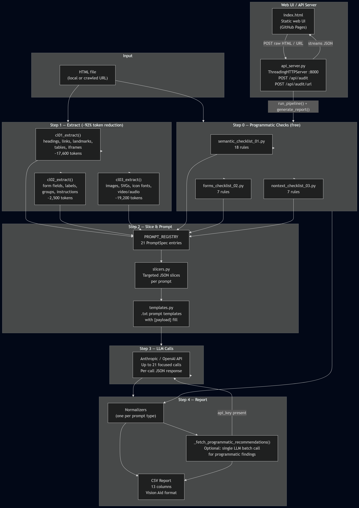

# visionaid-a11y-llm-audit

LLM-powered tools that analyze websites for WCAG accessibility issues and generate structured remediation reports. A Computing for Good course project at Georgia Tech (OMSCS) partnered with the Vision Aid Digital Accessibility Testing Team.

## Architecture Overview



## How It Works

The pipeline takes a raw HTML file and produces targeted accessibility findings through four steps:

```
HTML file (e.g. 1.9 MB)
    │
    │  Step 0 — Programmatic Checks (no API cost)
    │  Rule-based detection of missing alt, empty links, duplicate IDs, etc.
    │
    │  Step 1 — Extract
    │  Three extractors parse the HTML into structured JSON payloads,
    │  discarding layout noise (CSS, scripts, divs) and keeping only
    │  semantically relevant content. ~92% token reduction.
    │
    ├── semantic_checklist_01.py  → headings, links, landmarks, tables, iframes
    ├── forms_checklist_02.py    → form fields, labels, groups, instructions
    └── nontext_checklist_03.py  → images, SVGs, icon fonts, media
                                    Combined: ~39k tokens (from ~487k)
    │
    │  Step 2 — Slice & Call
    │  Each payload is sliced into targeted pieces. Each slice is paired
    │  with a focused prompt template and sent to the LLM individually.
    │  Up to 21 element-specific calls.
    │
    │  Step 3 — Save
    │  Raw JSON results are saved per-prompt for downstream processing.
    │
    │  Step 4 — Report
    │  The report generator reads all saved results, normalizes findings
    │  from both programmatic and LLM sources, and writes a unified CSV.
    │  If an API key is provided, a single extra LLM call enriches the
    │  programmatic findings with actionable fix recommendations.
```

## Repository Structure

```
├── entry_points/                                # Pipeline entry points
│   ├── run_pipeline.py                          # Main entry point — runs the full pipeline
│   ├── generate_report.py                       # Combines findings into unified CSV report
│   ├── api_server.py                            # Local HTTP server (web UI + REST API)
│   └── get_visionaid_home.py                    # Downloads visionaid.org homepage
│
├── processing_scripts/
│   ├── llm/                                     # Modular prompt system + templates
│   │   ├── registry.py                          #   Maps each evaluation task to its template + slicer
│   │   ├── templates.py                         #   Parses .txt prompt files, fills {payload} placeholders
│   │   ├── slicers.py                           #   Extracts targeted JSON slices from extractor payloads
│   │   ├── filters.py                           #   Pass-1 filter flags (programmatic → skip LLM prompts)
│   │   ├── semantic_checklist_01.txt            #   7 prompts for semantic structure
│   │   ├── forms_checklist_02.txt               #   6 prompts for form accessibility
│   │   └── nontext_checklist_03.txt             #   8 prompts for non-text content
│   │
│   ├── llm_client/                              # Standalone Claude API client (Andrew)
│   │   ├── client.py                            #   API wrapper (AuditClient / OpenAIAuditClient)
│   │   ├── prompt_loader.py                     #   Prompt loading utilities
│   │   └── runner.py                            #   End-to-end audit runner
│   │
│   ├── llm_preprocessing/                       # HTML → structured JSON extractors
│   │   ├── semantic_checklist_01.py             #   Headings, links, landmarks, tables, iframes
│   │   ├── forms_checklist_02.py                #   Form fields, label associations, groups
│   │   └── nontext_checklist_03.py              #   Images, SVGs, icon fonts, media
│   │
│   ├── programmatic/                            # Rule-based checks (no LLM needed)
│   │   ├── semantic_checklist_01.py             #   18 semantic structure rules
│   │   ├── forms_checklist_02.py                #   7 form accessibility rules
│   │   └── nontext_checklist_03.py              #   7 non-text content rules
│   │
│   ├── docs/pipeline.md                         # Pipeline architecture documentation
│   └── accessibility_audit_walkthrough.ipynb    # Andrew's end-to-end audit notebook
│
├── test_files/                                 # EXISTING — HTML files to analyze
│   ├── home.html                               #   visionaid.org homepage (~1.9 MB)
│   └── dat_visionaid_home.html                 #   Smaller trimmed variant (~143 KB)
│
├── semantic_checklist/                         # EXISTING — Source of truth: Deque WCAG checklist PDFs
│   ├── 01-semantic-checklist.pdf
│   ├── 02-forms-checklist.pdf
│   └── 03-nontext-checklist.pdf
│
├── vision_aid/ingestion/                       # EXISTING — HTML download utility
│   └── pull_html.py
│
├── pipeline_walkthrough.ipynb                  # Colab-compatible step-by-step pipeline notebook
│
├── docs/                                       # Architecture documentation
│   └── modular-prompts-plan.md                 #   Full architectural plan
│
├── index.html                                  # Team/project website (GitHub Pages)
├── styles.css                                  # Website styles
│
├── reports/                                    # LLM audit result files
│   └── audit_*.json                            #   Raw JSON output from llm_client runs
│
├── test_results/
│   ├── chatgpt/                                # Legacy ChatGPT testing results
│   └── claude/                                 # Pipeline-generated CSV reports
│       └── report_YYYY-MM-DD.csv
│
└── output/                                     # Generated at runtime (not committed)
    ├── manifest.json
    ├── programmatic_findings.json
    ├── payloads/
    └── prompts/
```

## Setup

Requires Python 3.11+.

```bash
git clone <repo-url>
cd visionaid-a11y-llm-audit

python -m venv venv
source venv/bin/activate        # Linux/macOS
# or: venv\Scripts\activate     # Windows

pip install -e .
```

Create a `.env` file in the project root with your API key(s). Only needed for live runs — not dry runs:

```
ANTHROPIC_API_KEY=sk-ant-...
OPENAI_API_KEY=sk-proj-...      # optional, only for OpenAI models
```

## Running the Pipeline

### Dry run (no API calls, no cost)

Generates all prompts and saves them as JSON files so you can inspect them before spending money:

```bash
python entry_points/run_pipeline.py --html test_files/dat_visionaid_home.html --dry-run
```

### Live run

Sends prompts to the LLM and saves responses:

```bash
python entry_points/run_pipeline.py --html test_files/home.html
```

### Generate report

After a live run, combine all findings into a single CSV:

```bash
python entry_points/generate_report.py
python entry_points/generate_report.py --output-dir ./output --report-dir ./test_results/claude/
```

### Pipeline CLI options

| Flag | Default | Description |
|------|---------|-------------|
| `--html` | (required) | Path to the HTML file to analyze |
| `--output-dir` | `./output` | Directory for results |
| `--model` | `claude-sonnet-4-20250514` | Model to use (Claude or OpenAI) |
| `--dry-run` | off | Generate prompts without calling the API |
| `--include-summaries` | off | Include the 3 cross-cutting summary prompts |
| `--show-cost` | off | Print estimated dollar cost based on model pricing |
| `--env-file` | `.env` | Path to environment file |

### Report generator CLI options

| Flag | Default | Description |
|------|---------|-------------|
| `--output-dir` | `./output` | Directory containing pipeline output |
| `--report-dir` | `./test_results/claude/` | Directory to write the CSV report |

## Web UI and API Server

The project includes a local HTTP server that serves the team website and exposes a REST API for running audits from the browser.

### Starting the server

```bash
python entry_points/api_server.py
# or on a different port:
python entry_points/api_server.py --port 8080
```

Then open `http://localhost:8000` in a browser. The server serves `index.html` and `styles.css` from the project root and handles audit requests via POST.

> **Important:** Always start the server with `python entry_points/api_server.py`. Running `python -m http.server` on the same port will serve static files only and return HTTP 501 for POST requests.

### API endpoints

#### `POST /api/audit`

Run an audit on raw HTML submitted in the request body.

**Request body (JSON):**

```json
{
  "html": "<html>...</html>",
  "model": "claude-sonnet-4-20250514",
  "api_key": "sk-ant-...",
  "openai_api_key": "sk-proj-..."
}
```

All fields except `html` are optional. API keys in the request body take priority over the `.env` file. If no API key is provided, the server runs programmatic checks only (no LLM calls).

**Response (JSON):**

```json
{
  "success": true,
  "report_path": "test_results/claude/report_2026-04-18.csv",
  "findings": [...],
  "usage": {"input_tokens": 18000, "output_tokens": 4200},
  "cost_usd": 0.12
}
```

#### `POST /api/audit/url`

Crawl a URL (and optional subpages) and run an audit. Streams NDJSON progress events.

**Request body (JSON):**

```json
{
  "url": "https://example.com",
  "model": "claude-sonnet-4-20250514",
  "api_key": "sk-ant-...",
  "depth": 1
}
```

**Response:** NDJSON stream — each line is a JSON object:

```jsonl
{"type": "progress", "message": "Fetching https://example.com..."}
{"type": "progress", "message": "Running pipeline on page 1/3..."}
{"type": "result", "success": true, "findings": [...], "usage": {...}}
```

### API key handling

- **Anthropic models** (default, any model not starting with `gpt-`, `o1`, `o3`, `o4`): use the `api_key` request field or `ANTHROPIC_API_KEY` env var.
- **OpenAI models** (`gpt-*`, `o1*`, `o3*`, `o4*`): use the `openai_api_key` request field or `OPENAI_API_KEY` env var.
- Per-request keys always take priority over environment variables.
- When entering an API key in the browser UI, paste rather than type — browsers may autocapitalize the first character of password inputs, producing an invalid key.

## LLM Recommendations for Programmatic Findings

When an API key is provided, `generate_report.py` makes one additional LLM call to generate actionable fix recommendations for the programmatic (rule-based) findings.

- **Deduplication**: Only unique `rule_id` values are sent, so a rule that fires 20 times on the page results in one recommendation, not 20 API calls.
- **Enrichment**: Returned recommendations are mapped back onto every matching row in the CSV report's `recommendation` column.
- **Fallback**: If the API call fails or no key is provided, rows retain their generic rule-based recommendation text.
- **Logging**: The call appears in the same format as other pipeline prompts:
  ```
    [programmatic_recommendations] Calling claude-sonnet-4-20250514 (~1,200 tokens)... OK (2.1s, 1,200 in / 380 out)
  ```

The prompt and parsing logic live in `entry_points/generate_report.py` in `_RECOMMENDATIONS_PROMPT` and `_fetch_programmatic_recommendations()`.

## Architecture Deep-Dive

### Extractors (existing code)

Each extractor has an `extract(file_path)` function that parses HTML with BeautifulSoup and returns a structured dict:

| Extractor | Focus | Output tokens (visionaid.org) |
|-----------|-------|-------------------------------|
| `semantic_checklist_01.py` | Page title, headings, links, landmarks, tables, iframes | ~17,600 |
| `forms_checklist_02.py` | Form fields with label source, instructions, required flags | ~2,500 |
| `nontext_checklist_03.py` | Images (4 categories), SVGs, icon fonts, video/audio | ~19,200 |

These files live in `processing_scripts/llm_preprocessing/` and were authored by ahildebrandt3 and Andrew Yin. They should not need modification unless a new checklist (CL04+) is added.

### Programmatic Checkers

Each checker returns a list of finding dicts. Rules fire independently of the LLM — no API key is needed.

| Checker | Rules | Sample rule IDs |
|---------|-------|----------------|
| `semantic_checklist_01.py` | 18 | `HEAD_001` missing page title, `HEAD_004` skipped heading levels, `LINK_001` empty link text, `DUP_001` duplicate IDs |
| `forms_checklist_02.py` | 7 | `FORM_001` unlabeled input, `FORM_003` missing fieldset/legend |
| `nontext_checklist_03.py` | 7 | `IMG_001` missing alt attribute, `SVG_001` SVG without title |

### Prompt Registry Pattern (new)

The core of the modular system is in `processing_scripts/llm/`:

- **`registry.py`** — Defines 21 `PromptSpec` dataclass entries, each linking a prompt name to its template file, slicer function, WCAG criteria, and output type. This is the single source of truth for what the pipeline evaluates.

- **`slicers.py`** — Contains one function per prompt (e.g., `slice_headings()`, `slice_flagged_links()`) that extracts exactly the data that prompt needs from the full extractor payload. This is what achieves the token reduction.

- **`templates.py`** — Parses the `.txt` prompt template files (which contain multiple numbered prompts separated by dashed headers) and fills in the `{payload}` placeholder with the sliced JSON at runtime.

| Checklist | Prompts | Example names |
|-----------|---------|---------------|
| CL01 — Semantic | 7 (+ 1 summary) | `page_title`, `heading_structure`, `link_clarity`, `landmark_regions`, `data_tables`, `iframes`, `reading_order` |
| CL02 — Forms | 6 (+ 1 summary) | `form_labels`, `form_instructions`, `form_errors`, `form_groups`, `form_required`, `form_submit` |
| CL03 — Non-text | 8 (+ 1 summary) | `image_alt`, `decorative_images`, `complex_images`, `svg_accessibility`, `icon_fonts`, `video_captions`, `audio_transcripts`, `animated_content` |

### Pass-1 Filters

`processing_scripts/llm/filters.py` implements "Pass 1 filtering": programmatic findings suppress certain LLM prompts to avoid redundant API calls. For example, if `HEAD_004` (skipped heading level) fires, the `heading_structure` LLM prompt is skipped.

### PipelineClient

`run_pipeline.py` defines `PipelineClient`, a thin wrapper around both Anthropic and OpenAI APIs:

- Accepts the API key directly (unlike `AuditClient` which reads from env)
- Defaults to `max_tokens=8192`
- Logs duration and token usage in a consistent format
- Returns `{"success": bool, "response": str, "usage": {...}, "duration_seconds": float, "error": str|None}`

`generate_report.py` imports and reuses `PipelineClient` for the programmatic recommendations call so logging and error handling remain consistent across all LLM calls.

### Pipeline Orchestrator (new)

`entry_points/run_pipeline.py` ties everything together:

1. Runs the three extractors to get structured payloads
2. Runs programmatic checks on the HTML
3. Applies Pass-1 filter flags based on programmatic findings
4. Iterates over the prompt registry, slicing payloads and assembling prompts
5. Calls the LLM for each non-empty prompt (or saves dry-run output)
6. Writes a manifest with token counts, timing, and cost data

### Report Generator (new)

`entry_points/generate_report.py` reads the pipeline output and produces a flat CSV:

1. Loads `manifest.json` for run metadata (date, model)
2. Normalizes `programmatic_findings.json` into report rows via `normalize_programmatic()`
3. Optionally enriches programmatic rows with LLM recommendations via `_fetch_programmatic_recommendations()`
4. For each `output/prompts/*.json`, applies a prompt-specific normalizer that understands the response schema and extracts issues
5. Assigns sequential IDs and writes to `test_results/claude/report_YYYY-MM-DD.csv`

The normalizer registry mirrors the prompt registry — one normalizer function per prompt type that knows how to detect issues in that prompt's response shape.

## How to Extend

### Adding a new prompt type

1. **Slicer** — Add a function in `processing_scripts/llm/slicers.py` that extracts the relevant data from the extractor payload
2. **Template** — Add a new numbered prompt section to the appropriate `.txt` file in `processing_scripts/llm/`
3. **PromptSpec** — Add an entry in `processing_scripts/llm/registry.py` linking the slicer, template, and WCAG criteria
4. **Normalizer** — Add a normalizer function in `entry_points/generate_report.py` and register it in the `NORMALIZERS` dict

### Adding a new extractor/checklist (CL04+)

1. Create a new extractor in `processing_scripts/llm_preprocessing/` with an `extract(file_path)` function
2. Create corresponding prompt templates in `processing_scripts/llm/`
3. Add slicer functions in `processing_scripts/llm/slicers.py`
4. Register new `PromptSpec` entries in `processing_scripts/llm/registry.py`
5. Add normalizers in `entry_points/generate_report.py`
6. Update `entry_points/run_pipeline.py` to call the new extractor

## Output Structure

### Pipeline output (`output/`)

```
output/
├── manifest.json                 # Run metadata, token counts, prompt status
├── programmatic_findings.json    # Rule-based checker results (free)
├── payloads/                     # Raw extractor output (for inspection)
│   ├── cl01_payload.json
│   ├── cl02_payload.json
│   └── cl03_payload.json
└── prompts/                      # One file per prompt
    ├── page_title.json           # Contains prompt text, payload slice, and API response
    ├── heading_structure.json
    ├── link_clarity.json
    └── ...
```

### Report output (`test_results/claude/`)

The report CSV has 13 columns matching the Vision Aid team's standard format:

| Column | Description |
|--------|-------------|
| `ID` | Sequential row number |
| `element_name` | HTML element (e.g. ``, `<a> "link text"`) |
| `browser_combination` | Always `N/A` (static HTML analysis) |
| `page_title` | Page title from the analyzed HTML |
| `issue_title` | Short issue description |
| `steps_to_reproduce` | Element snippet or inspection steps |
| `actual_result` | What was found |
| `expected_result` | What WCAG requires |
| `recommendation` | Suggested fix |
| `wcag_sc` | WCAG success criterion (e.g. `1.1.1`) |
| `category` | Issue category (e.g. `Programmatic / Non-text Content`) |
| `log_date` | Date of the pipeline run |
| `reported_by` | `Programmatic` or the LLM model string |

## Cost Estimate

For visionaid.org homepage (using Claude Sonnet):

| Approach | Input tokens | Cost |
|----------|-------------|------|
| Monolithic (entire HTML) | ~487,000 | ~$1.52 |
| Element-specific pipeline | ~18,000 | ~$0.32 |

The pipeline skips prompts with empty payloads (e.g., no forms on the page = no form prompts), so actual cost varies by page content. Use `--dry-run` to inspect prompts and `--show-cost` to estimate cost before spending money.

## Attribution

| Contributor | What they own | Key files |
|---|---|---|
| ahildebrandt3 | Extractors, programmatic checkers (CL01–CL03), CL01 prompts | `processing_scripts/llm_preprocessing/`, `processing_scripts/programmatic/` |
| Andrew Yin | CL02 + CL03 extractors, CL02 + CL03 prompts, LLM client, pipeline docs | `processing_scripts/llm_preprocessing/`, `processing_scripts/llm_client/`, `processing_scripts/llm/*.txt` |
| nfulton99 | HTML ingestion, packaging | `vision_aid/ingestion/pull_html.py`, `pyproject.toml` |
| ColeANiblett | Pipeline orchestration, prompt system, report generator | `processing_scripts/llm/{registry,slicers,templates}.py`, `entry_points/`, `docs/` |
